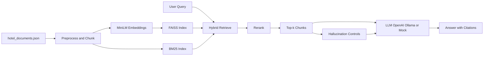

# StayChat AI — RAG-Based Hotel Q&A System

Retrieval-Augmented Generation pipeline for answering natural-language questions about hotels from a curated document corpus (40 synthetic documents).

## Problem Statement

Hotel guests and travel agents often need quick, specific answers ("does Hotel X have free breakfast and WiFi?", "what's the cancellation policy?") that generic search or static FAQ pages answer poorly. StayChat AI was built to evaluate whether a retrieval-augmented pipeline could answer these queries accurately, with citations, and without hallucinating facts not present in the source documents — a requirement for any customer-facing hospitality tool.

**Success criteria defined up front:**
- Answers must be grounded only in the provided hotel documents (no hallucination)
- Both keyword-style queries ("free WiFi") and vague/preference queries ("suggest a hotel near the beach with great reviews") must be handled
- The system must be swappable across LLM backends (OpenAI, Ollama, or a no-cost mock) so it isn't locked to one vendor

## Quick start (clone from GitHub)

```
git clone https://github.com/YOUR_USERNAME/YOUR_REPO.git
cd YOUR_REPO
python -m venv .venv
.venv\Scripts\activate          # Windows
pip install -r requirements.txt
python main.py --all
```

The FAISS index is not in the repo (see `.gitignore`); `main.py --all` rebuilds it automatically.

## Architecture



## Decision Matrix

| Component | Options Considered | Choice Made | Rationale |
|---|---|---|---|
| Chunking | Fixed-size vs sentence-aware | Sentence-aware, 280 chars, 60 overlap | Preserves context across amenity/policy passage boundaries |
| Embeddings | Various pre-trained models | `all-MiniLM-L6-v2` (384-d) | Strong semantic search, local, no API cost |
| Retrieval | Dense-only vs hybrid | FAISS `IndexFlatIP` + BM25 hybrid | Sparse catches exact-phrase matches (e.g. "complimentary breakfast") that embeddings can miss |
| Top-k | Fixed k=5 vs variable | k=7 (10 for list-style queries) | Better recall for multi-hotel comparison queries |
| LLM backend | Single vendor vs pluggable | OpenAI / Ollama / mock, swappable | Avoids vendor lock-in; mock allows zero-cost testing (see `outputs/hallucination_ablation.md`) |

## Dataset (40 documents)

| Category | Count |
| --- | --- |
| Hotel descriptions | 9 |
| Amenities | 7 |
| Guest reviews | 10 |
| Policies | 7 |
| Location | 7 |

Source: synthetic (MIT). File: `data/hotel_documents.json`.

## Project layout

```
Task/
├── SUBMISSION.md
├── config.py
├── main.py
├── requirements.txt
├── data/
├── src/
│   ├── preprocessing.py
│   ├── embed_store.py
│   ├── hybrid_retrieval.py
│   ├── retrieval.py
│   ├── generation.py
│   ├── evaluation.py
│   └── hallucination.py
├── tests/test_rag.py
├── index/
└── outputs/
```

## Setup

```
cd Task
python -m venv .venv
.venv\Scripts\activate
pip install -r requirements.txt
```

Optional:
```
set OPENAI_API_KEY=sk-...
set USE_OLLAMA=1
```

## Run

```
python main.py --all
python -m unittest tests.test_rag -v
```

## Example queries

| ID | Query |
| --- | --- |
| Q1 | Which hotels have free WiFi and complimentary breakfast? |
| Q2 | What is the cancellation policy of Hotel X? |
| Q3 | Suggest a hotel with excellent reviews near the beach. |

Results: `outputs/sample_outputs.md`

## Risk Register

| Risk | Impact | Mitigation / Status |
|---|---|---|
| Mock LLM uses lexical overlap, not fluent generation | Lower answer quality in demo mode | Enable OpenAI/Ollama for production use |
| Manual relevance labels only cover 3 queries | Evaluation metrics are indicative, not statistically robust | Flagged in evaluation output; would expand labeled set for production |
| No cross-encoder reranking or NLI-based verification yet | Some risk of subtly wrong answers passing hallucination checks | Documented as a planned production enhancement |

## Task checklist

- [x] Task 1: Cleaning, chunking (280/60) with justification
- [x] Task 2: Hybrid embeddings + FAISS/BM25 + top-k
- [x] Task 3: Context-only prompt + Q1–Q3
- [x] Task 4: Metrics with workings + detailed qualitative analysis
- [x] Task 5: Hallucination control + ablation
