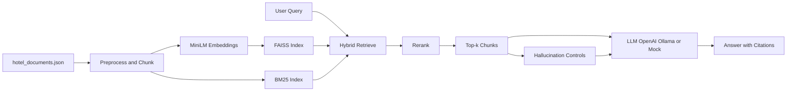

# StayChat AI — RAG-Based Hotel Q&A System

Retrieval-Augmented Generation pipeline for answering natural-language questions about hotels from a curated document corpus (40 synthetic documents).

> **Submission guide:** see [SUBMISSION.md](SUBMISSION.md) — add your name before submitting.

## Quick start (clone from GitHub)

```bash
git clone https://github.com/YOUR_USERNAME/YOUR_REPO.git
cd YOUR_REPO
python -m venv .venv
.venv\Scripts\activate          # Windows
pip install -r requirements.txt
python main.py --all
```

The FAISS index is not in the repo (see `.gitignore`); `main.py --all` rebuilds it automatically.

## Architecture



| Component | Choice | Rationale |
|-----------|--------|-----------|
| Chunking | Sentence-aware, **280** chars, **60** overlap | Splits longer amenity/policy passages; overlap preserves WiFi/breakfast context across boundaries |
| Embeddings | `all-MiniLM-L6-v2` (384-d) | Strong semantic search, local, no API cost |
| Vector DB | FAISS `IndexFlatIP` + **BM25** hybrid | Dense recall + sparse keyword match (e.g. “complimentary breakfast”) |
| Top-k | **7** (10 for list queries) | Better multi-hotel recall than k=5 |
| LLM | OpenAI / Ollama / **generic mock** | Mock is query-agnostic (no hardcoded demo branches) |
| Hallucination | Threshold + term grounding + prompt + verification | See `outputs/hallucination_ablation.md` |

## Dataset (40 documents)

| Category | Count |
|----------|------:|
| Hotel descriptions | 9 |
| Amenities | 7 |
| Guest reviews | 10 |
| Policies | 7 |
| Location | 7 |

Source: synthetic (MIT). File: `data/hotel_documents.json`.

## Project layout

```
Task/
├── SUBMISSION.md
├── config.py
├── main.py
├── requirements.txt
├── data/
├── src/
│   ├── preprocessing.py
│   ├── embed_store.py
│   ├── hybrid_retrieval.py
│   ├── retrieval.py
│   ├── generation.py
│   ├── evaluation.py
│   └── hallucination.py
├── tests/test_rag.py
├── index/
└── outputs/
```

## Setup

```bash
cd Task
python -m venv .venv
.venv\Scripts\activate
pip install -r requirements.txt
```

Optional:

```bash
set OPENAI_API_KEY=sk-...
set USE_OLLAMA=1
```

## Run

```bash
python main.py --all
python -m unittest tests.test_rag -v
```

## Example queries

| ID | Query |
|----|-------|
| Q1 | Which hotels have free WiFi and complimentary breakfast? |
| Q2 | What is the cancellation policy of Hotel X? |
| Q3 | Suggest a hotel with excellent reviews near the beach. |

Results: `outputs/sample_outputs.md`

## Known limitations

1. Mock LLM uses lexical overlap — enable OpenAI or Ollama for fluent paraphrasing.
2. Manual relevance labels for three queries; metrics are indicative.
3. Production would add cross-encoder reranking and NLI-based verification.

## Task checklist

- [x] Task 1: Cleaning, chunking (280/60) with justification
- [x] Task 2: Hybrid embeddings + FAISS/BM25 + top-k
- [x] Task 3: Context-only prompt + Q1–Q3
- [x] Task 4: Metrics with workings + detailed qualitative analysis
- [x] Task 5: Hallucination control + ablation
